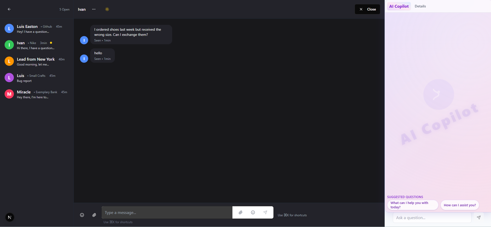
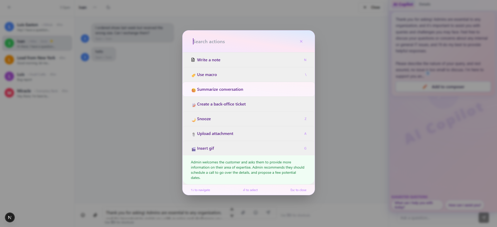

# Support Copilot

**AI-powered customer support made easy**

[Live Demo](https://chatbot-indol-seven.vercel.app/)

---

## 🚀 Overview

Support Copilot is a modern, Intercom-inspired customer support dashboard with AI Copilot features for admins. Built as part of the BeyondChats internship assignment.

---

## ✨ Features

- **Multi-panel Layout:**  
  - Left: Customer inbox with avatars, previews, and unread indicators.
  - Center: Chat area with message bubbles, avatars, and message status.
  - Right: AI Copilot panel with suggested questions, AI answers, and "Add to composer".

- **AI Copilot Panel:**
  - Dynamic, context-aware suggested questions.
  - AI-generated answers with "Show more" and "Add to composer" functionality.
  - Beautiful animated gradient, watermark, and modern card UI.

- **Floating AI Toolbar:**
  - Appears when selecting text in the admin composer.
  - Offers actions like Rephrase, Tone, Translate, etc.
  - Processes selected text via backend and displays results in a modal.

- **Action Menu (Admin):**
  - Summarize conversation (AI-generated summary sent as admin message).
  - Write note, Use macro, Create ticket, Upload attachment, Insert GIF, and more.

- **Mobile Responsive:**  
  - Panels stack vertically on mobile.
  - Touch-friendly buttons and inputs.
  - Fully usable on all screen sizes.

- **Dark/Light Mode:**  
  - Toggle between beautiful light and dark themes.

- **Transitions & Animations:**  
  - Subtle fade-ins, button hover effects, animated gradients, and glassmorphism.

- **Other Features:**
  - Image support in chat.
  - Admin/customer role switching.
  - Dummy data for customers and conversations.
  - Clean, modular React/NextJS codebase.

---

## 📸 Screenshots

### Login Page


### Main Dashboard (Desktop)


### Action Modal & AI Copilot



### Floating AI Toolbar


### Dark Mode


---

## 🛠️ Tech Stack

- **Framework:** Next.js (React)
- **Styling:** Tailwind CSS
- **AI Backend:** Dummy API endpoint (can be swapped for OpenAI, Cohere, etc.)
- **Deployment:** Vercel ([Live Demo](https://chatbot-indol-seven.vercel.app/))

---

## 📱 Mobile Responsiveness

- Fully responsive layout using Tailwind's responsive classes.
- Panels stack vertically on mobile.
- All UI elements are touch-friendly and readable.

---

## 📝 Assignment Details

This project was built for the BeyondChats internship assignment:


## 🧑‍💻 How to Run Locally

1. **Clone the repo:**
   ```bash
   git clone https://github.com/yourusername/support-copilot.git
   cd support-copilot
   ```

2. **Install dependencies:**
   ```bash
   npm install
   # or
   yarn install
   ```

3. **Run the development server:**
   ```bash
   npm run dev
   # or
   yarn dev
   ```

4. **Open [http://localhost:3000](http://localhost:3000) in your browser.**

---

## 📂 Project Structure

- `/components` – All UI components (SuggestionPanel, MessageList, MessageComposer, etc.)
- `/pages` or `/app` – Next.js page routing and main layout
- `/public` – Static assets (avatars, icons)
- `/styles` – Tailwind and global styles

---

## 🙏 Credits

- Inspired by Intercom's AI admin panel.
- Built for BeyondChats internship assignment.
- [Live Demo](https://chatbot-indol-seven.vercel.app/)

---

## 📣 Notes

- All AI features use a dummy backend; swap in your own API keys for real AI responses.
- Dummy data is used for customers and conversations.
- You own all rights to this code.

---

**Thank you for reviewing my submission!**